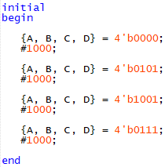

# Seven-segment display decoder
# The decoder is used to light up seven-segment display which can display any number from 0 to 9. The decoder is designed specifically for common cathode display.

The program is compiled in Intel Quartus Prime and run under the testbench to perform the functional computation.  
The decoder takes 4-bit input denoted as A, B, C, and D, which represents the number of 0 to 9 in binary.  
Using a truth table, the corresponding circuit is then mapped out to determine which number will causes which segment of the seven-segment display to light up.  

 

   
  Truth Table for seven-segment display decoder  
   
  Input test 

 
1. Number 0
 

   
  a = 1 
  b = 1 
  c = 1 
  d = 1 
  e = 1 
  f = 1 
  g = 0 
  h = 0 

 
2. Number 5
 

   
  a = 1 
  b = 0 
  c = 1 
  d = 1 
  e = 0 
  f = 1 
  g = 1 
  h = 0 

 
3. Number 9
 

   
  a = 1 
  b = 1 
  c = 1 
  d = 0 
  e = 0 
  f = 1 
  g = 1 
  h = 0 

 
4. Number 7
 

   
  a = 1 
  b = 1 
  c = 1 
  d = 0 
  e = 0 
  f = 0 
  g = 0 
  h = 0 

